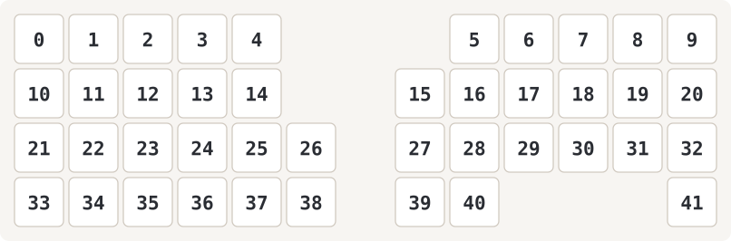

キー位置番号。`config/mona2.keymap` の `bindings` はこの 0 → 41 の順に並びます。

---

COROPITを使用する方は以下のようにコードを編集してください。

mona2_r.overlay

修正前
```
  trackball_central: trackball_central@0 {
        status = "okay";
        compatible = "pixart,pmw3610";  //トラボセンサ用のドライバとバインド
        reg = <0>;
        spi-max-frequency = <2000000>;
        irq-gpios = <&gpio0 2 (GPIO_ACTIVE_LOW | GPIO_PULL_UP)>; //P0.02を指定(MOTION)
        cpi = <600>;
        //swap-xy;
        //invert-x; //COROPIT版ではコメントアウトを外す
        //invert-y; //COROPIT版ではコメントアウトを外す
        evt-type = <INPUT_EV_REL>;
        x-input-code = <INPUT_REL_X>;
        y-input-code = <INPUT_REL_Y>;
    };
};

```
**修正後**
```
  trackball_central: trackball_central@0 {
        status = "okay";
        compatible = "pixart,pmw3610";  //トラボセンサ用のドライバとバインド
        reg = <0>;
        spi-max-frequency = <2000000>;
        irq-gpios = <&gpio0 2 (GPIO_ACTIVE_LOW | GPIO_PULL_UP)>; //P0.02を指定(MOTION)
        cpi = <600>;
        //swap-xy;
        invert-x; //COROPIT版ではコメントアウトを外す
        invert-y; //COROPIT版ではコメントアウトを外す
        evt-type = <INPUT_EV_REL>;
        x-input-code = <INPUT_REL_X>;
        y-input-code = <INPUT_REL_Y>;
    };
};

```

---

## 無線でファームウェアを書き換える

[blueboot](https://github.com/te9no/zmk-feature-blueboot) を入れてあるので、基板を
ばらして USB を挿さなくても、BLE DFU でファームウェアを更新できる。ZMK 本体に OTA は
無いが、XIAO nRF52840 の Adafruit ブートローダーが持つ BLE OTA 機能を叩く仕組み。

転送経路は 2 つある。**PC から焼く方が速いので基本はこちら。**

| 経路 | パケット長 | 速度の目安 | 備考 |
| --- | --- | --- | --- |
| **PC**（`tools/ble_flash.py`） | 最大 244 バイト | 速い | 内蔵 Bluetooth で可。要 OTAFIX |
| iPhone / Android アプリ | **iOS は 20 バイト固定** | iOS で約 2 KB/s | 手軽。PC が無くても焼ける |

iOS の nRF DFU アプリは 20 バイトパケットに制限されていて（OTAFIX の README に
明記されている）、OTAFIX の高 MTU を活かせない。273 KB の右手側で 2 分以上かかる。
PC 経路は Bleak 経由で **PC 内蔵の Bluetooth がそのまま使える**（nRF52840 ドングルは
不要。ドングルが要るのは nRF Connect for Desktop の話）。

### 0. 最初の一回だけ USB で仕込む

blueboot 入りのファームウェアを最初に入れるところは、どうしても USB になる。
左右それぞれにダブルリセット → UF2 ドライブへ `.uf2` をコピー。ここまで済めば
以降は無線で更新できる。

`&blueboot` は**押した側の半分しか DFU モードに入らない**ので、左右に 1 個ずつ
置いてある。キー位置番号は README 冒頭の図を参照。

| レイヤー | 位置 | ベースでのキー | 入る半分 |
| --- | --- | --- | --- |
| layer_1（数字・マウス） | pos 39 | 右親指 `&mt LEFT_SHIFT TAB` | 右手（親機） |
| layer_3（ナビ・選択） | pos 37 | 左親指 `&lt 1 SPACE` | 左手 |

layer_1 は `&lt 1 SPACE`(pos 37) と `&lt 1 ENTER`(pos 40) で入る。pos 39 と pos 40 は
隣り合う右親指キーなので、ENTER をホールドしたまま隣を叩くと DFU に落ちる。
layer_3 も `&lt 3 LANGUAGE_2`(pos 38) の隣が pos 37。

#### 誤爆したとき

**リセット 1 回で ZMK に戻る。** 焼き直しもペアリングのやり直しも不要。
`&blueboot` は GPREGRET に `0xA8` を書いて再起動するだけで、ブートローダーは
起動直後にその値をクリアする。転送を始めていなければアプリ領域は無傷なので、
次の起動で普通に ZMK が立ち上がる。

- 電源スイッチがあれば OFF → ON。無ければリセット 1 回（`RST` と `GND` を 1 回ショート）
- **ダブルリセットはしない**（USB の UF2 ドライブに入ってしまう）
- 右手を誤爆すると親機が落ちるのでキーボード全体が無反応になる。
  左手を誤爆した場合は右手だけで入力を続けられる
- どちら側でも `&sys_reset` では直せない。reset 系 behavior は locality が
  event source なので、押した側しかリセットできない

放置すると自動では戻らない（`bootloader_dfu_start` のタイムアウトが 0 で無期限待機）。
BLE 広告を続けて電池を食うだけなので、片側が急に死んだらまず電源を入れ直す。

### 1. ビルド（push するだけ）

`config/mona2.keymap` を編集して push するだけ。
GitHub Actions が `.uf2` をビルドし、続けて DFU 用 ZIP に変換して
[`dfu-latest` リリース](https://github.com/inoue0907/zmk-config-moNa2-v2/releases/tag/dfu-latest)
を作り直す。変換のための PC 環境（Python や adafruit-nrfutil）は不要。

置かれるファイル:

| ファイル | 用途 |
| --- | --- |
| `mona2_l-blueboot.zip` | 左手側を BLE DFU で更新 |
| `mona2_r-blueboot.zip` | 右手側を BLE DFU で更新 |
| `mona2_l.uf2` / `mona2_r.uf2` | OTA が失敗したときの USB 復旧用 |

### 2. 焼く: PC から（推奨）

[`tools/ble_flash.py`](tools/ble_flash.py) を `uv` で走らせる。依存は PEP 723 の
インラインメタデータに書いてあるので、`uv` さえあればどの PC でも環境構築は不要。

1. キーボードで `&blueboot` を押して DFU モードに入れる
2. これを実行する

```bash
uv run tools/ble_flash.py --side r
```

`--side r` で右手、`--side l` で左手。`dfu-latest` リリースから DFU ZIP を自動で
落としてくるので、ファイルを手で用意する必要はない。手元の ZIP を使うなら `--zip PATH`。

- `--wait` 見つかるまでスキャンを繰り返す（先にコマンドを叩いておける）
- `--no-high-mtu` 転送が早々に `Operation Failed` になるとき
- `--prn 0` PRN を切って最速を狙う
- `--yes` 確認プロンプトを省略

DFU プロトコルの実装は [recrof/nrf_dfu_py](https://github.com/recrof/nrf_dfu_py) の
`dfu_lib.py` を使う。**あちらはライセンス表記が無いのでリポジトリには同梱していない。**
コミット固定で実行時に取得し、SHA-256 を検証して `~/.cache/zmk-ble-flash/` に置く。

### 3. 焼く: iPhone から

1. App Store で Nordic Semiconductor の
   **nRF Device Firmware Update** を入れる（iOS 16 以上）。
   うまく動かないときは同社の **nRF Toolbox** の DFU 機能でも代用できる。
2. Safari で上の `dfu-latest` リリースを開き、`mona2_l-blueboot.zip` を
   タップ → 「ダウンロード」。リリースの添付ファイルは直リンクなので、
   GitHub へのログインも ZIP の展開も要らない。ファイルアプリの
   「ダウンロード」に入る。
3. 更新したい側で `&blueboot` を押す。その半分が再起動して BLE で見えるように
   なる（キーボードとしては一旦落ちる）。広告名は標準ブートローダーなら
   **`AdaDFU`**、OTAFIX を入れてあれば **`XIAO_DFU`**。
4. アプリで手順 2 の ZIP を選び、デバイス一覧からその名前を選んで転送開始。
   終わると自動で ZMK に戻る。
5. 反対側も 2〜4 を繰り返す。**左右を同時に更新してはいけない。**

#### アプリの設定

OTAFIX 2.x の[推奨設定](https://github.com/oltaco/Adafruit_nRF52_Bootloader_OTAFIX#recommended-ota-dfu-settings)は
**PRN ON / Number of packets 30**。ここを 8 にすると 20 バイト × 8 = 160 バイトごとに
往復確認が入って約 2 KB/s まで落ちるので、必ず 30 にする（iOS では 60 超は非推奨）。
ほかは Disable resume ON / Force scanning ON / Keep bond OFF。

**Request high MTU** と **Prepare object delay** は iOS には存在しない。前者は iOS が
MTU を自動ネゴシエートするため、後者は Secure DFU 用の設定で Legacy DFU には
無関係なため。

転送前に対象側の電池を充電しておくこと。転送中に電圧が落ちると失敗する。

### 4. 運用: 右手だけ更新していい場合

キーマップは親機（右手）にしか無い。左手は押されたキー位置を転送するだけで、
レイヤー解決・コンボ・ホールドタップは全部右手が処理する。左手側で走らせる
behavior も「デバイス名」で引かれるので、behavior を足しても左右の対応はズレない。

つまり `config/mona2.keymap` の bindings / レイヤー / コンボ / マクロ /
`sensor-bindings` をいじっただけなら、**右手だけ無線更新すれば済む**。
片側だけなので同時更新の心配も無い。

左右そろえて焼き直しが必要なのは次のとき:

- `boards/shields/mona2/mona2.dtsi` や `mona2_l.overlay` を変えた（マトリクス・センサ・物理配列）
- `config/mona2_l.conf` を変えた
- `config/west.yml` の ZMK 本体リビジョンを上げた（split のプロトコルが変わり得る）
- **左手側で実行する behavior を新しく足した**（`&blueboot` 追加時がこれ。
  左手に置いた `&blueboot` を実行するのは左手の firmware なので、
  左手を焼いていないと押しても何も起きない）

### 5. OTAFIX ブートローダー

**現状: 右手側は導入済み（`0.9.2-OTAFIX2.3-BP1.4`）。左手側はまだ工場出荷の 0.6.1。**

入れなくても blueboot は動くが、**PC 経路（高 MTU）を使うには OTAFIX が必要**。

標準の Adafruit ブートローダーは、アプリ領域が無効な状態だと **USB のシリアル /
UF2 モード**で待つ（XIAO のボード定義は `DEFAULT_TO_OTA_DFU` を有効にしていない）。
つまり転送が途中で切れた場合、無線では復旧できず USB 接続が必要になる。
ブートローダー領域はアプリの DFU では触られないので、何回失敗しても
UF2 ドライブへ `.uf2` をコピーすれば戻る。文鎮化はしない。

[OTAFIX ブートローダー](https://github.com/oltaco/Adafruit_nRF52_Bootloader_OTAFIX)
は Adafruit ブートローダーの非公式フォークで、ここが BLE DFU フォールバックに
変わる。主な差分:

- **アプリが無効ならリセットで BLE DFU 待機に戻る**（標準は USB モードに落ちる）
- **MTU を 23 → 247 バイトに拡大**。ただし活かせるのは Android アプリと
  `tools/ble_flash.py` だけ。**iOS アプリは 20 バイト固定なので恩恵が無い**
- **小パケットの結合**。64 バイト未満の書き込みを最大 240 バイトにまとめてから
  flash に書くので、iOS 経路でも多少は速くなる
- **遅延消去**。標準はアプリ領域を全消去してから受信するので開始した瞬間に
  既存ファームが無効になるが、OTAFIX は必要なページだけ順次消す
- BLE の送信出力を +8dBm に
- DFU 広告名が `XIAO_DFU`（標準は `AdaDFU`）
- ダブルリセット → USB UF2 ドライブ は引き続き使えるので最終手段は残る

#### 入れるかどうかの判断

**PC 経路で焼くなら入れる。** 高 MTU が使えるかどうかで転送時間が桁違いになり、
転送が短いほど失敗しにくい。加えて失敗しても USB が不要になる。

入れなくてもよいのは、**スマホからしか焼かず、かつ組み立てた状態で USB ポートに
ケーブルを挿せる**場合。iOS は 20 バイト固定で高 MTU の恩恵が無いので、
残るメリットは失敗時の復旧経路だけになる。

書き換え自体はこの手順で唯一やり直せない操作（版を間違えると SWD ライターが必要）
なので、`Board-ID` の確認は飛ばさないこと。

なお**誤爆時の復帰はリセット 1 回で、OTAFIX とは無関係**。あちらのリスク軽減には
ならない。OTAFIX は ZMK ファームとは独立なので後からいつでも追加できる。

#### 導入手順

USB で一度だけ。**「0. 最初の一回だけ USB で仕込む」と同じ分解作業なので、
片側ずつまとめて済ませる**のが良い。手順は片側につき:

1. XIAO を USB につなぐ。
2. 約 0.5 秒以内にリセット 2 回で UF2 ドライブを出す。リセットボタンが無ければ
   `RST` と `GND` を素早く 2 回ショート。
3. ドライブの `INFO_UF2.TXT` を開いて `Board-ID` を確認する。**ここが一番大事。**
4. [OTAFIX の最新リリース](https://github.com/oltaco/Adafruit_nRF52_Bootloader_OTAFIX/releases/latest)
   から対応する `update-..._nosd.uf2`（70KB 程度）を落とす。
   - `Board-ID: nRF52840-SeeedXiaoSense-v1` → `update-xiao_nrf52840_ble_sense_bootloader-..._nosd.uf2`
   - それ以外の XIAO nRF52840 BLE → `update-xiao_nrf52840_ble_bootloader-..._nosd.uf2`
5. UF2 ドライブへコピー。自動でリセットがかかる。
6. もう一度ダブルリセットして UF2 ドライブを出し、`INFO_UF2.TXT` が OTAFIX に
   なっているか確認する。
7. 続けて ZMK 本体（`dfu-latest` リリースの `mona2_l.uf2` / `mona2_r.uf2`）を
   同じドライブへコピーする。
8. 反対側も 1〜7 を繰り返す。

`_nosd` は SoftDevice（S140 7.3.0）をそのまま残してブートローダー部分だけ
差し替える版。同じリリースにある `.hex` / `.zip` は SoftDevice 込みの完全版で、
SWD ライター用なので UF2 ドライブには使わない。

導入できたかは `&blueboot` を押したときの BLE 広告名で分かる。
**`AdaDFU` なら標準のまま、`XIAO_DFU` になっていれば OTAFIX が入っている。**

**非 Sense の XIAO でも Sense 用ブートローダーが入っている個体がある。**
製品名や外観ではなく必ず `INFO_UF2.TXT` に合わせること。間違えると USB も
出なくなり SWD ライターが必要になる。標準版に戻したい場合は
[Adafruit 標準ブートローダー](https://github.com/adafruit/Adafruit_nRF52_Bootloader/releases/latest)
の `update-xiao_nrf52840_ble..._nosd.uf2` を同じ手順で入れる。

### 困ったとき

- **OTA が途中で切れた（標準ブートローダー）**
  アプリ領域が無効になっているので、次のリセットで UF2 ドライブが出て待機する。
  USB をつないで `dfu-latest` の `mona2_l.uf2` / `mona2_r.uf2` をコピーすれば戻る。
  ブートローダー自体は無傷なので、何回失敗してもこの経路は残る。
- **OTA 失敗後に USB ドライブもシリアルポートも出ない**
  OTAFIX を入れている場合、BLE DFU 待機のままかもしれない。`XIAO_DFU` を探すか、
  ダブルリセットで UF2 モードに戻す。
- **DFU パッケージが弾かれる**
  ブートローダーの `INFO_UF2.TXT` で SoftDevice 版を確認する。CI の変換は
  S140 7.3.0（firmware ID `0x0123`）向けが既定。違う場合は
  `.github/workflows/build.yml` の `blueboot.py` 呼び出しに `--sd-req` を足す。
- **DFU に留まらず ZMK が起動してしまう**
  前のアプリがまだ有効なだけ。もう一度 `&blueboot` を押す。
- **片側だけ更新したら左右がつながらない**
  左右で ZMK のビルドを揃える。必要ならペアリングをやり直す。
